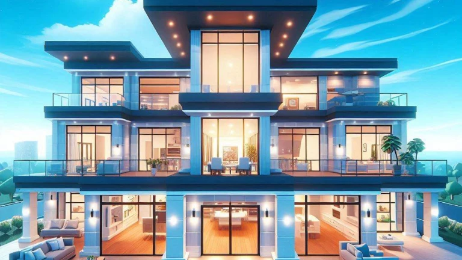
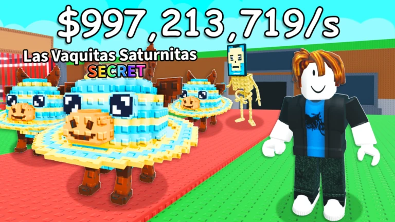

---
# try also 'default' to start simple
theme: default
# random image from a curated Unsplash collection by Anthony
# like them? see https://unsplash.com/collections/94734566/slidev
# some information about your slides (markdown enabled)
title: Roblox Multimedia Netiquette
info: |
  ## Slidev Starter Template
  Presentation slides for developers.

  Learn more at [Sli.dev](https://sli.dev)
# apply UnoCSS classes to the current slide
fonts:
  # basically the text
  sans: Google Sans Flex
  # use with `font-serif` css class from UnoCSS
  serif: Zain
  # for code blocks, inline code, etc.
  mono: Google Code Flex
# https://sli.dev/features/drawing
drawings:
  persist: false
# slide transition: https://sli.dev/guide/animations.html#slide-transitions
transition: fade-out
# enable MDC Syntax: https://sli.dev/features/mdc
mdc: true
# duration of the presentation
duration: 35min
class: text-gray-100
---

| <h3 class="text-sky-300 font-semibold">Nama</h3> | <h3 class="text-fuchsia-300 font-semibold">NIM</h3> |
|---|---|
| Tora Eleazar Tarigan | 251401037 |
| Jhon Piter Situmorang | 251401052 |
| M. Axel Daffa Ramadhan | 251401061 |
| Montela Beril Saragih | 251401091 |
| Ridho Pandapotan Pulungan | 251401142 |

---
transition: slide-up
class: text-gray-300 text-3xl
title: Roblox?
---

<video
  autoplay
  muted
  loop
  playsinline
  src="./assets/Homepage_Hero_Video_fixed.mp4"
  class="absolute inset-0 w-full h-full object-cover -z-1"
/>

<v-click >

</v-click>

<v-after>
  
  # Roblox?

</v-after>

<v-click>Platform permainan multiplayer online berbasis multimedia interaktif yang menggabungkan:</v-click>

<v-clicks>

- 🧊 Grafik 3D
- 🖥️ Animasi,
- 🎵 Audio, dan
- 📤 Elemen interaktif.

</v-clicks>

 

Selain game, Roblox juga merupakan platform pembuatan game (Roblox Studio).

---
transition: fade
class: bg-gray-900/80 text-gray-100
---

# Komponen Multimedia Roblox

| <h3>Komponen</h3> | <h3>Deskripsi</h3> |
|---------|-----------|
| teks | <v-click>Chat antar pemain, UI game, instruksi permainan.</v-click> |
| gambar | <v-click>Icon, menu, HUD, texture game.</v-click> |
| grafik 3d | <v-click>Model karakter, dunia game, objek 3D, map.</v-click> |
| video | <v-click>Musik latar, efek suara lingkungan, suara karakter.</v-click> |
| audio | <v-click>Trailer game, cutscene (di beberapa game).</v-click> |
| animasi | <v-click>Gerakan avatar, animasi objek, efek visual (VFX).</v-click> |

---
layout: two-cols
layoutClass: gap-16
class: text-gray-100
transition: slide-right
---

# Tujuan

<v-clicks>

- Menjadi platform bermain game online yang interaktif.
- Memberi kesempatan pengguna untuk membuat game sendiri tanpa coding yang rumit.
- Menjadi wadah sosialisasi digital bagi pemain dari seluruh dunia.
- Memberikan peluang monetisasi bagi developer (Robux → uang nyata).

</v-clicks>

::right::

# Pengguna Sasaran

<v-clicks>

- Anak-anak dan remaja (5+ tahun)
- Developer pemula
- Gamer online
- Konten kreator game

</v-clicks>

---
transition: fade
---

# Teknologi Multimedia yang Diterapkan

  <h3>👋 Interaktif</h3>
  
Kontrol karakter, gameplay multiplayer, GUI interaktif.

  <h3>🤖 AI</h3>
  
NPC (musuh/karakter otomatis), scripting perilaku game.

  <h3>⚙️ 3D Engine</h3>
  
Dunia game 3D, fisika objek, pencahayaan, animasi.

  <h3>💭 Cloud Technology</h3>
  
Penyimpanan game online, server multiplayer.

---
transition: fade
class: text-gray-100
---

  
  

    <h3 class="text-emerald-300">➕ Kelebihan</h3>

  

      
      - Platform sangat mudah dipakai untuk pemula membuat game
      - Komunitas besar, banyak resource & tutorial
      - Banyak jenis game (multiplayer, simulasi, obby, roleplay, dll.)
      - Bisa dimainkan di banyak device (PC, HP, tablet)
      - Sistem avatar & ekonomi virtual (Robux) bikin pengalaman sosial kuat
      - Interaktif & cocok untuk eksperimen multimedia (3D, audio, animasi, UI)
      
  

  

  
  

    <h3 class="text-rose-300">➖ Kekurangan</h3>
    
  

    - Banyak game buatan amatir, kualitasnya tidak selalu bagus
    - Monetisasi (Robux) kadang bikin pay-to-win
    - Moderasi tidak selalu sempurna, potensi toxic/negatif tetap ada
    - Performa game buatan user kadang berat atau tidak stabil
    - Fitur scripting & engine cukup basic dibanding Unity/Unreal
    - Iklan/brand content bisa mengganggu immersion
    
  

  

---
transition: fade-out
---

# Thank you !!